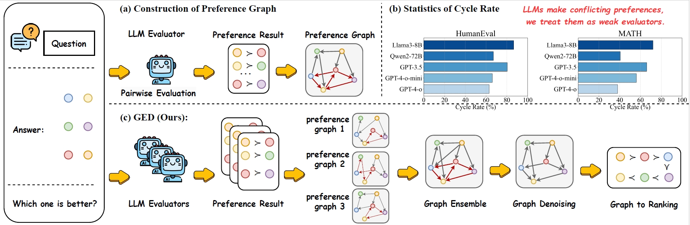

# Towards Acyclic Preference Evaluation of Language Models via Multiple Evaluators


<h1 style="text-align:left">
    
</h1>
<figcaption style="text-align:center; font-size:small; margin-top:-1em;">
    Framework of GED.
</figcaption>


## 1. Setup

Install all required dependencies to ensure all scripts function correctly.

```bash
conda env create -f environment.yml -n GED
```

## 2. Response Selection Setting

**2.1 Raw preference garph generation**

You can use the following script to generate responses for tasks such as HumanEval, AlpacaEval, MATH, GSM8k, and GAIA:

```
./answer_gen/response-selection/gen.sh
```

Then, use the following script to generate the raw preference graph:

```
cd raw_preference_graph_gen

./response.sh -i /path/to/input_data \
              -o /path/to/output_folder \
              -m llama3-7b \
              -g 4 \
              -d humaneval \
              --api_base http://localhost:8000 \
              --model_path xxx/llama3-7b \
              --port 8080 \
              --threads 32
```

You can see more parameter details in `./raw_preference_graph_gen/response.sh`.


Below is a case of a generated raw preference graph:
```
{
    "0":{
        "gaia_llama3-70b_2 | gaia_llama3-70b_9": 1,
        "gaia_llama3-70b_10 | gaia_llama3-70b_4": 0,
        "gaia_llama3-70b_3 | gaia_llama3-70b_4": 0,
        "gaia_llama3-70b_8 | gaia_llama3-70b_10": 1,
        "gaia_llama3-70b_3 | gaia_llama3-70b_2": 1,
        "gaia_llama3-70b_9 | gaia_llama3-70b_10": 1,
        "gaia_llama3-70b_8 | gaia_llama3-70b_2": 1,
        "gaia_llama3-70b_5 | gaia_llama3-70b_6": 1
        ...
    },
    ...
}
```
Here, `"0"` represents the first question in the GAIA dataset and `gaia_llama3-70b_2` represents the third response among the ten responses generated by `llama3-70b`. The  `"gaia_llama3-70b_2 | gaia_llama3-70b_9": 1` indicates that the evaluator considers the response `gaia_llama3-70b_2` to be better than `gaia_llama3-70b_9`.


**2.2 Graph denoise**

This script generates denoise the preference graph by  single evaluators to get the final response ranking.

```bash
./denoise_response.sh \
    --eval_model llama3-8b \
    --answer_model qwen2-72b \
    --task_name gaia \
    --rank_type pairwise_majority
```


- `--eval_model`: The model used for evaluation.  (Like: 'llama3-8b').
- `--answer_model`: The model generating the answers.  (Like: 'qwen2-72b').
- `--task_name`: The task for evaluation. (Like: 'gaia').
- `--rank_type`: The ranking method. (Like: 'pairwise_majority').


**2.3 Result Evaluation**

Use the scripts in the following folder to test the final results:

```
./evaluation/response_selection/scripts
```

## 3. Model Ranking Setting


**3.1 Raw preference garph generation**

Download the answers of 30 models from the ./evaluation/model-rank/model_rank_config.py file in the [AlpacaEval](https://tatsu-lab.github.io/alpaca_eval/) project .


Then, use the following script to generate the raw preference graph,:


```
cd raw_preference_graph_gen

./model_rank.sh -i /path/to/input_data \
              -o /path/to/output_folder \
              -m llama3-7b \
              -g 4 \
              -d alpacaeval \
              --api_base http://localhost:8000 \
              --model_path xxx/llama3-7b \
              --port 8080 \
              --threads 32
```

You can see more parameter details in `./raw_preference_graph_gen/response.sh`.


Below is a case of a generated raw preference graph:
```
{
    "0": {
        "Qwen1.5-72B-Chat | Mixtral-8x22B-Instruct-v0.1": 1,
        "gpt-3.5-turbo-0301 | oasst-sft-llama-33b": 1,
        "tulu-2-dpo-70b | wizardlm-13b": 1,
        "Meta-Llama-3-8B-Instruct | vicuna-13b-v1.3": 1,
        "gpt4_0314 | gpt-4-turbo-2024-04-09": 0,
        "tulu-2-dpo-70b | dbrx-instruct": 0,
        "Yi-34B-Chat | vicuna-7b": 1,
        "mistral-medium | Qwen1.5-7B-Chat": 1,
        ...
    },
    ...
}
```

Here, `"0"` represents the first question in AlpacaEval, and `Qwen1.5-72B-Chat` denotes the responses generated by `Qwen1.5-72B-Chat`. The entry `"Qwen1.5-72B-Chat | Mixtral-8x22B-Instruct-v0.1": 1` indicates that the evaluator considers the response from `Qwen1.5-72B-Chat` to be superior to that of `Mixtral-8x22B-Instruct-v0.1`.


**3.2 Graph denoise**


This script generates denoise the preference graph by  single evaluators to select the final tuning data.

```bash
./denoise_model_rank.sh \
    --eval_model llama3_70b \
    --w_type noWeight \
    --rank_type pairwise_majority
```

- `--eval_model`: The model used for evaluation.  (Like: 'llama3_70b').
- `--w_type`: The type of ensemble method used. (Like: 'noWeight').
- `--rank_type`: The ranking method. (Like: 'pairwise_majority').


**3.3 Result Evaluation**

This script generates denoise the preference graph by  single evaluators to select the final tuning data.

```bash
./model-rank/evaluation/eval_model_rank.sh
```


## 4. Instruction tuning setting

**4.1 Raw preference garph generation**


You can use the following script to generate responses for `UltraFeedback`:

```
./answer_gen/instruction-tuning/gen.sh
```

Then, use the following script to generate the raw preference graph:

```
cd raw_preference_graph_gen

./response.sh -i /path/to/input_data \
              -o /path/to/output_folder \
              -m llama3-7b \
              -g 4 \
              -d ultrafeedback \
              --api_base http://localhost:8000 \
              --model_path xxx/llama3-7b \
              --port 8080 \
              --threads 32
```


The generated preference graph is similar to the one in **2.1 Raw Preference Graph Generation**.


**4.2 Graph denoise**


This script generates denoise the preference graph by  single evaluators to get the final response ranking.

```bash
./denoise_instruction.sh \
    --eval_model llama3-8b \
    --answer_model qwen1.5-14b \
    --task_name gaia \
    --rank_type pairwise_majority
```


- `--eval_model`: The model used for evaluation.  (Like: 'llama3-8b').
- `--answer_model`: The model generating the answers.  (Like: 'qwen1.5-14b').
- `--task_name`: The task for evaluation. (Like: 'ultra').
- `--rank_type`: The ranking method. (Like: 'pairwise_majority').


**4.3 Result Evaluation**

**Train**

We provide the training scripts for training the model. For example, you can run the following commands to train the model:
```
./instruction-tuning/evaluation/tuning.sh
```
The scripts can be easily modified to train LLMs with different datasets.


**Data Preparation**

1. Download the raw data from [*HH-RLHF*](https://github.com/anthropics/hh-rlhf), which should be named as `hhrlhf` and put it in the `./instruction-tuning/evaluation/data/raw_data` directory.

2. Run the following command to preprocess the data:
   ```
    cd ./instruction-tuning/evaluation
    python step_1_process.py
    python step_2_get_train_data.py
    python step_3_get_test_data.py
    ```


**Test LLMs with HH-RLHF**


```
./instruction-tuning/evaluation/run_infer_main_dist.sh
```
