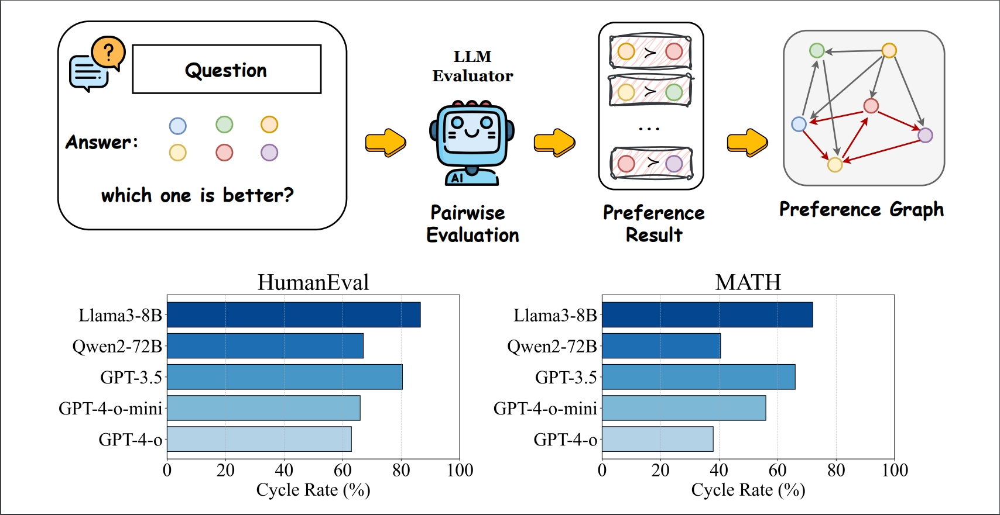

# Language Model Preference Evaluation with Multiple Weak Evaluators
This paper introduces GED (Preference Graph Ensemble and Denoise), a method designed to improve the evaluation of large language models' (LLMs) outputs by ensembling multiple weak evaluators and applying denoising techniques to resolve cyclic inconsistencies in preference graphs, resulting in more reliable, non-contradictory preference evaluations


<h1 style="text-align:left">
    
</h1>


## Setup

Install all required dependencies to ensure all scripts function correctly.

```bash
pip install -r requirements.txt
```

## Rank result generation

```bash
python rank_gen.py \
    --eval_model $eval_model \
    --answer_model $answer_model \
    --task_name $task_name \
    --w_type $w_type \
    --rank_type $rank_type
```

```bash
python result_gen.py \
    --w_type $w_type \
    --task_name $task_name \
    --answer_model $answer_model
```


